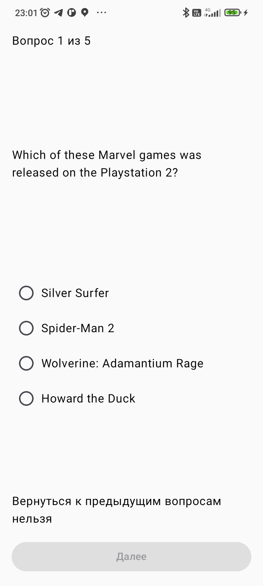
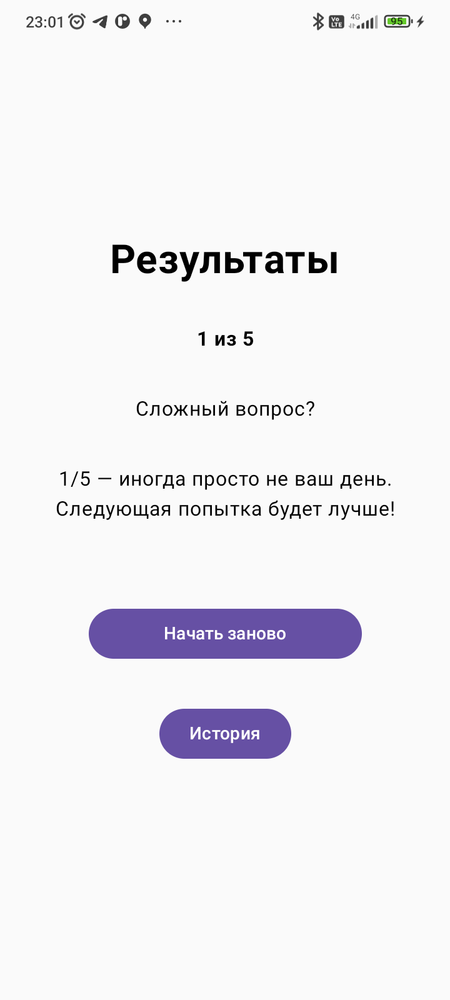
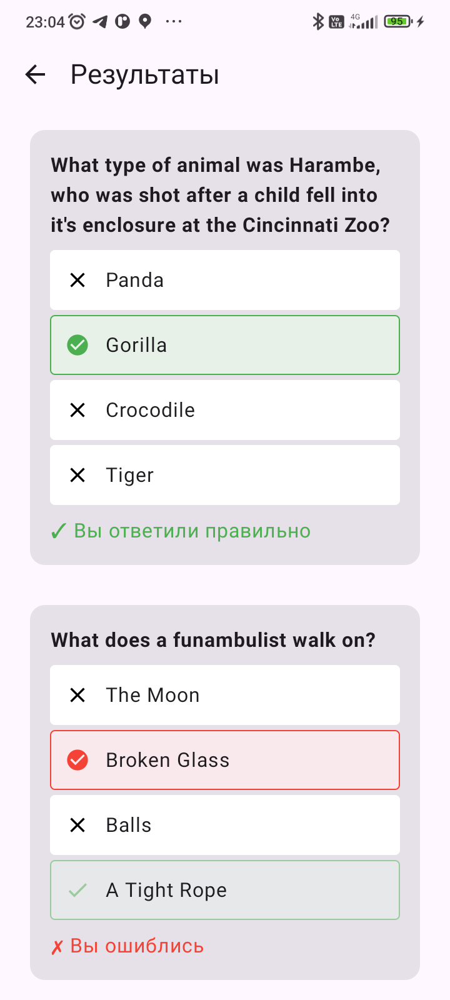

# DailyQuiz

Мобильное приложение для прохождения викторин с возможностью просмотра истории результатов.

## 📱 Скриншоты

| Стартовый экран | Викторина | Результаты | История | Детальная История                                        |
|-----------------|-----------|------------|---------|----------------------------------------------------------|
|  |  |  |  |  |

## 📌 Функционал

- 🎯 Прохождение викторины (5 вопросов)
- 📊 Сохранение результатов в локальную БД
- 🕒 Просмотр истории прохождений с датой
- 🔍 Детализация по каждому прохождению

## 🛠 Технологии

- **Архитектура**: MVVM + Clean Architecture
- **Асинхронность**: Kotlin Coroutines
- **Локальное хранилище**: Room Database
- **UI**: Jetpack Compose
- **Сеть**: Retrofit
- **Навигация**: Compose Navigation

## 🌐 Используемое API
Приложение использует Open Trivia DB: https://opentdb.com/

## 🔧 Настройка
Для кастомизации викторины измените параметры в data/remote/ApiService

## 🤝 Контакты
📧 @al35353535